# Retos HackSpace Perú - ANDROID
 

# Reto 1. Pomodoro app :alarm_clock:

Como primer proyecto tendras que desarrollar una aplicacion para aumentar tu productividad , utilizando la tecnica del [Pomodoro](https://lifehacker.com/productivity-101-a-primer-to-the-pomodoro-technique-1598992730).

## Aprendizaje :

* Implementación del diseño con ConstraintLayout.
* Animación para el button Iniciar.
* Implementación de OnClickListener.
* Implementación de Handler(thread) para refrescar el tiempo.
* Implementacón de Toast.
* Implementado en Activity.

        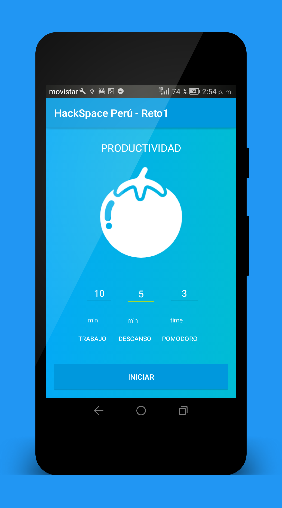
        
        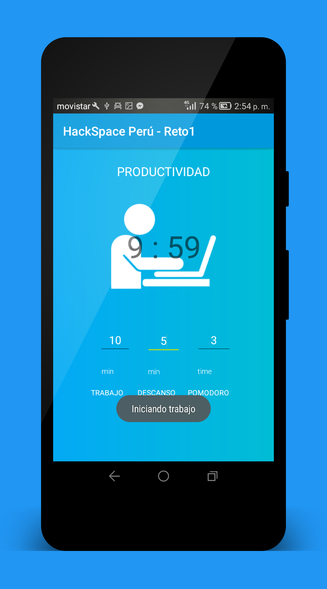
        
        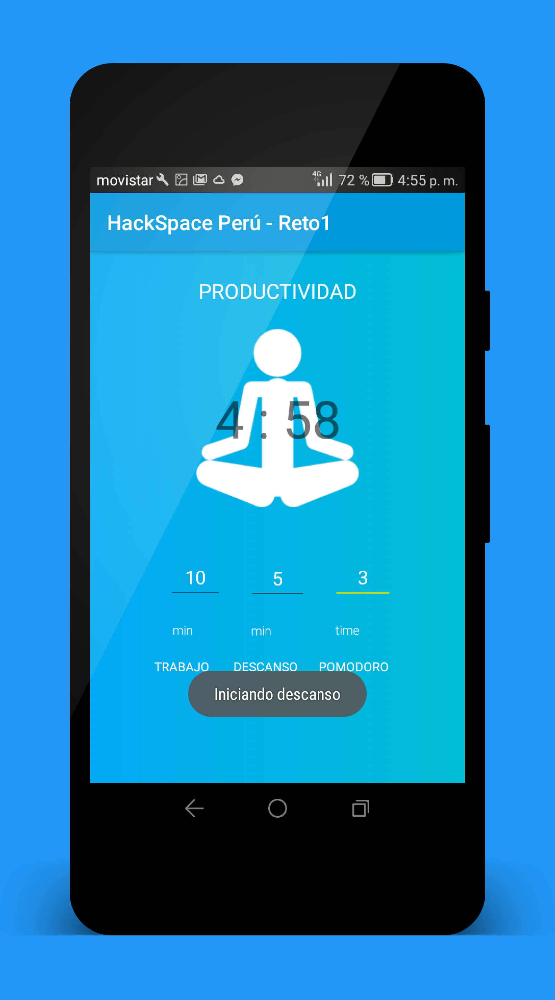
        
        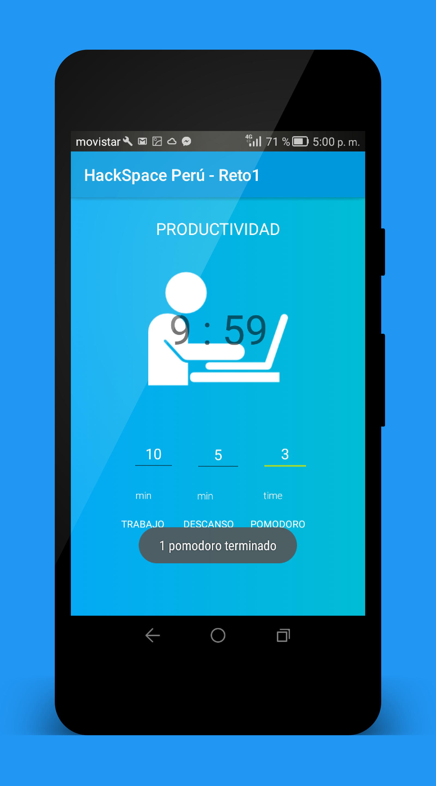
        

# Pasar datos entre actividades y enviar un correo :e-mail:

Utilice la primera actividad para ingresar datos de usuario, no es una autenticacion de usuario, y en la siguiente actividad muestre esos datos ingresados con lo explicado anteriormente y utilice algun tipo de Intent para poder lograr abrir el menu de opciones para poder enviar un correo.

## Aprendizaje :

* Implementación del diseño con Layouts.
* Implementación de CardView.
* Utilización de colores degradados.
* Pasar datos entre actividades encapsulando la Clase Hija(Fragment).
* Implementación de Snackbar y Toast.
* Implementación de Intent para enviar un Email.
* Implementado en Fragment.

        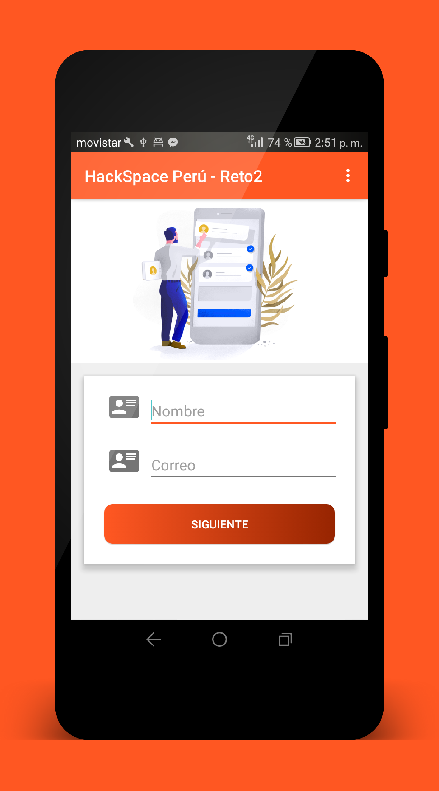
        
        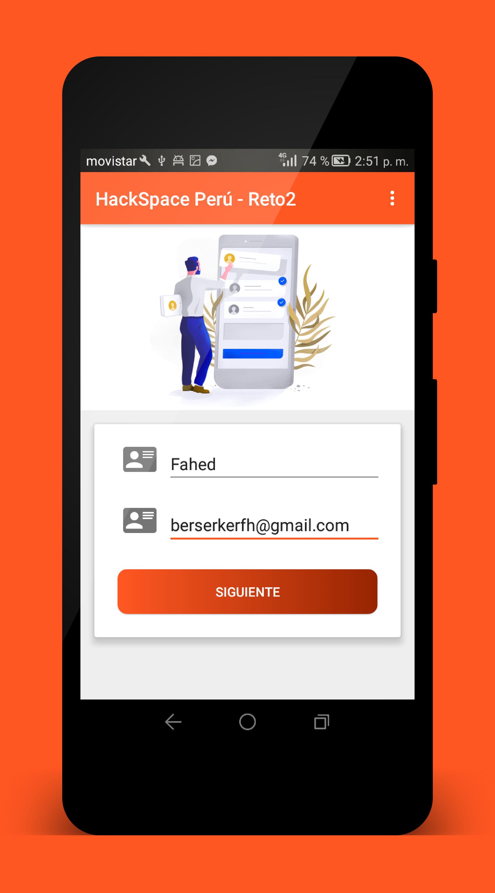
        
        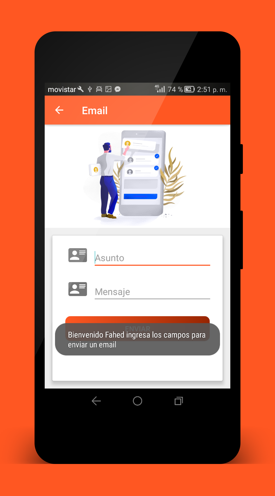
        
        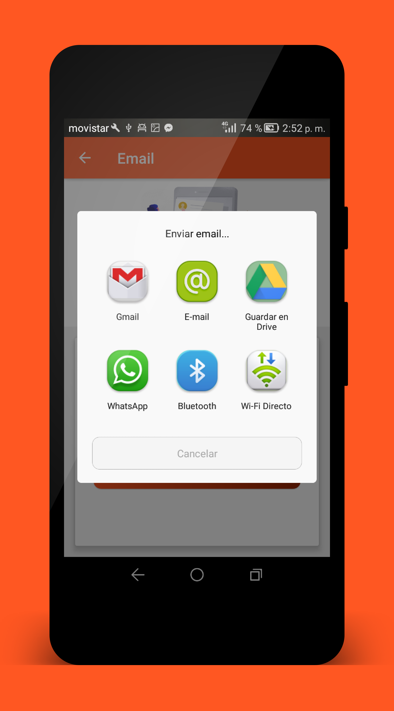
        
        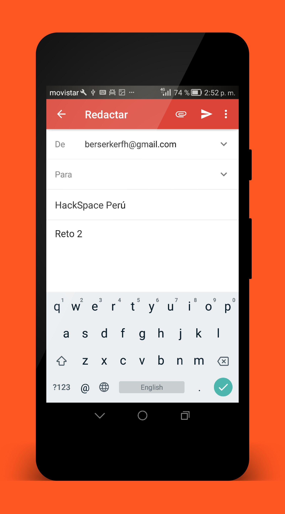
        

# CryptoCurrency App

Ya no es ajeno a nadie que las criptomonedas presentan una gran oprtunidad para todos , generando oportunidades de todo tipo ,incluyendo a los desarrolladores. Estar al tanto de como evolucionan las monedas a nivel mundial otorga una ventaja sobre aquellos que son mas nuevos.
Es por eso que la [criptoconcurrencia](https://blockgeeks.com/guides/what-is-cryptocurrency/) es un tema que viene en alza ultimamente.

Es por eso que como proyecto final desarrollaran una app de criptoconcurrencia donde se puedan seguir la evolucion a las criptomonedas mas demandadas

## Herramientas : 

- [API](https://coinmarketcap.com/)
- [Icons (Consumibles con alguna libreria de imagenes)](https://github.com/cjdowner/cryptocurrency-icons)

## Aprendizaje :

* Implementación del diseño con RecyclerView, CardView y ConstraintLayout.
* Implementado con el Estilo Arquitectonico MVP.
* Implementación con Retrofit para consumir servicios.
* Implementación con Picasso para consumir servicios.
* Implementación de RecyclerView con la clase Adapter y Model.
* Implementación de RecyclerView con Endless scroll.
* Implementado en Fragment.

        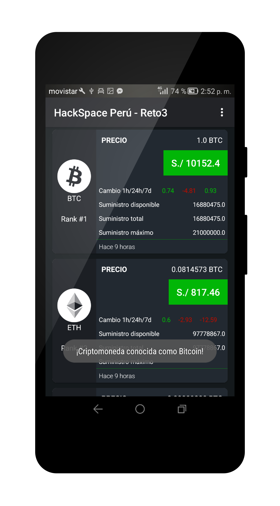
        
        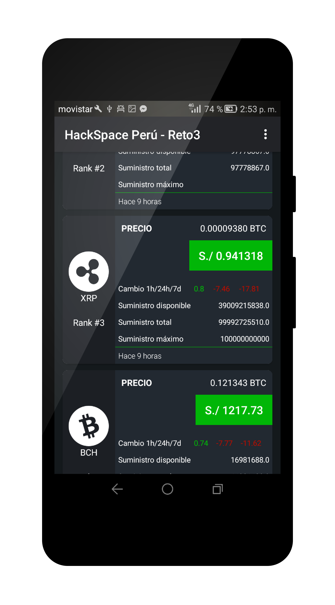
        
        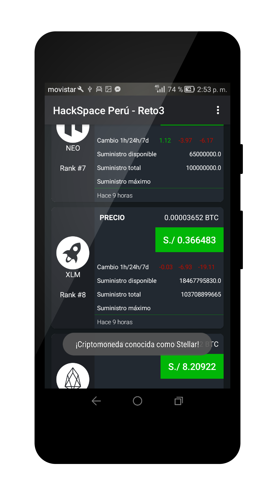
        

	
## Developed by

* Fahed Hermoza, Visitame en [Facebook](https://www.facebook.com/fahedhermoza/) para mas detalles.

